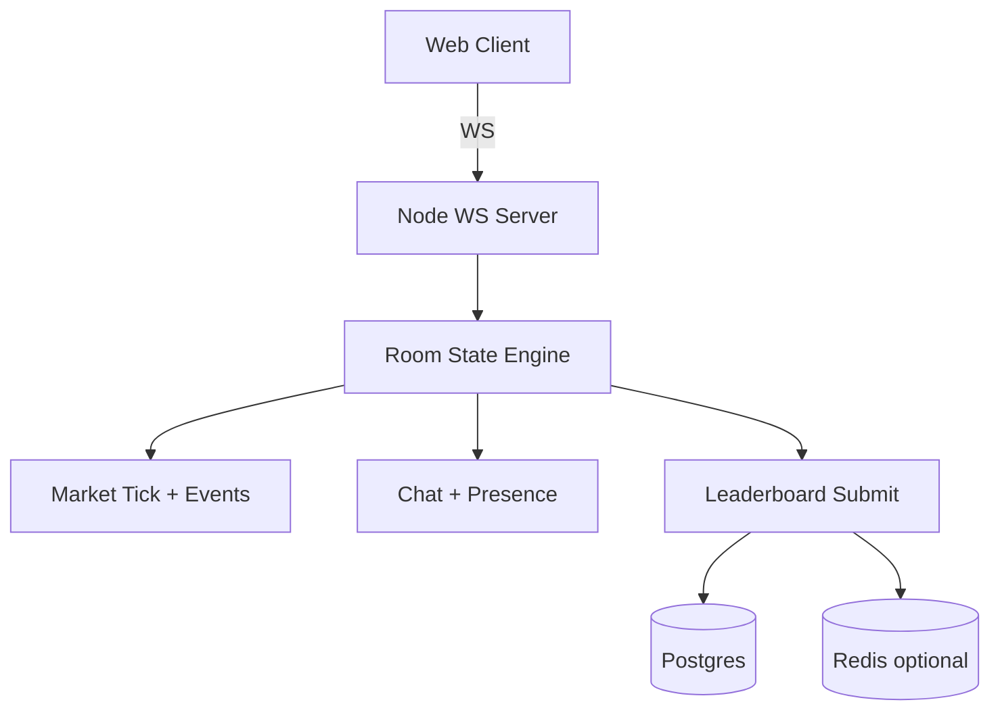

<div align="center">

# PK Candle

**"玩的不是币，是你自己的情绪。"**


A fast, meme‑heavy multiplayer market sim with synced rooms, real‑time chat, and a global leaderboard.

</div>

---

## Features

- **3‑minute sessions** with a shared, server‑authoritative market.
- **Global events** pause the room with big announcements.
- **Personal events** are private and affect **cash only**.
- **Room lock**: set a key when creating a room.
- **Leaderboard** uses a player name (no wallet login required).
- **Local history** stored in the browser.
- **Pixel/meme UI** built for streaming & sharing.

---

## Quick start

### Requirements
- Node.js >= 18
- pnpm >= 9

### Install
```bash
pnpm install
```

### Dev (web + server)
```bash
pnpm dev
```

### Web only
```bash
pnpm dev:web
```

### Server only
```bash
pnpm dev:server
```

---

## Game rules (current)

- **Countdown**: 5s once everyone is ready.
- **Session length**: 3 minutes (6 rounds).
- **Trading**: choose percent or cash size, leverage 1x+.
- **Liquidation**: when price hits liq line. Respawn after 5s pause.
- **Global events**: pause trading for 5s with a full‑screen banner.
- **Personal events**: pause trading for 10s; choices change cash only.

---

## Architecture



---

## Environment variables

### Web (`apps/web`)
- `VITE_WS_URL` (e.g. `ws://localhost:8080` or `wss://your-server`)

### Server (`apps/server`)
- `PORT` (default `8080`)
- `DATABASE_URL` (Postgres, e.g. Neon/Railway)
- `REDIS_URL` (optional, leaderboard cache)
- `ALLOW_MEMORY_LEADERBOARD` (set `true` to allow ephemeral in‑memory leaderboard)
- `REQUIRE_PRIVY_FOR_LEADERBOARD` (default `false`)
- `AUTO_SUBMIT_LEADERBOARD` (default `false`)
- `DB_CONNECT_TIMEOUT_MS` (optional, default `5000`)
- `DB_QUERY_TIMEOUT_MS` (optional, default `5000`)
- `REDIS_CONNECT_TIMEOUT_MS` (optional, default `3000`)
- `REDIS_OP_TIMEOUT_MS` (optional, default `2000`)
- `TICK_INTERVAL_MS` (default `1000`)
- `SESSION_DURATION_MS` (default `180000`)
- `COUNTDOWN_MS` (default `5000`)
- `EVENT_PAUSE_MS` (default `5000`)

---

## Deploy

### Web (Vercel)
- Set `VITE_WS_URL` to your Railway WS endpoint (`wss://`).
- Output directory: `apps/web/dist`.

### Server (Railway)
- Build: `pnpm --filter @pk-candle/server build`
- Start: `pnpm --filter @pk-candle/server start`
- Set `DATABASE_URL` (optional but recommended).
- If no DB: set `ALLOW_MEMORY_LEADERBOARD=true`.

### Database migrations
```bash
pnpm db:push
```

---

## Scripts

```bash
pnpm lint
pnpm -C apps/web typecheck
pnpm -C apps/server typecheck
pnpm test
```

---

## Repo layout

```
apps/
  web/        # Vite React frontend
  server/     # WebSocket server
packages/
  shared/     # Shared types + game logic
```

---

## Contributing

See `CONTRIBUTING.md` for local dev, testing, and code style.

---

## License

MIT
